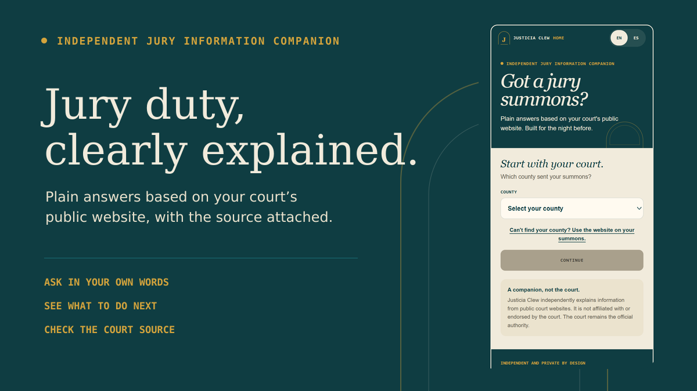
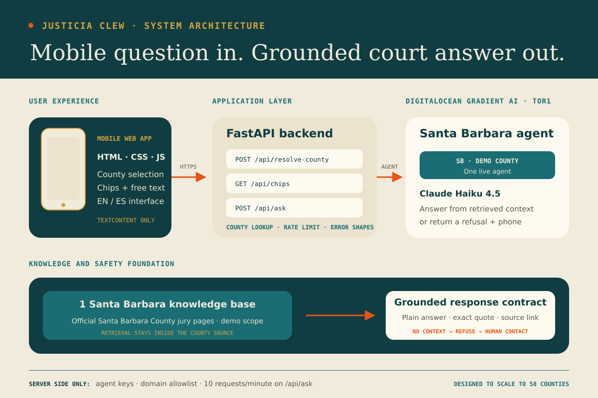

# Justicia Clew

Plain-language jury duty answers, in the court system's own words. Built for California, all 58 counties useful on day one via the statewide layer, deep coverage for demo counties (Santa Barbara, Los Angeles, San Francisco, Fresno, Inyo).

Citizen-facing sibling of Themis Lex. Themis Lex serves the people who run the court, Justicia Clew serves the people the court summons.

## What it does

You pick your county (or paste the court URL from your summons), tap a question or type your own, and get a plain-language answer with the exact source quote underneath. If the answer isn't in the court's own published pages, Justicia says so and gives you the jury office phone number instead of guessing.

## What it is not

Not legal advice. Not affiliated with or endorsed by any court. Not a prediction of whether you'll be called in, that's always the court's own portal or phone line. Not a place that remembers anything about you: no accounts, no history, no stored questions, no tracking.

## How it works

- Mobile-first web app, FastAPI backend, DigitalOcean Gradient AI (Knowledge Bases + Agents) as the AI layer.
- Answers are grounded only in ingested official content from each county's court site and the California Courts self-help center. Nothing else.
- Every answer names its source: your court's website, or the statewide Judicial Council site. Never blended silently.

## Independence disclaimer

This is a personal project, built on publicly available information. It is not affiliated with, endorsed by, or reviewed by any California court, the Judicial Council, or any county jury services office.

## Limitations

- Only Santa Barbara has a live knowledge base at demo time. The remaining 57 counties are served by the statewide Judicial Council layer for general questions, but county-specific answers (parking, local phone numbers, courthouse details) require per-county ingestion that hasn't been run yet.
- Knowledge base refresh is manual. A "last checked" timestamp is displayed per answer so users know the age of the source data.
- Spanish translations are not yet connected to grounded source content. The UI toggle is disabled until real Spanish-language court pages can be ingested.
- The refusal heuristic is keyword-based. Edge cases exist where the agent's phrasing may not be caught, resulting in a soft refusal rendered as a normal answer card.
- Rate limiting is in-memory and resets on server restart. Not suitable for sustained production traffic without a persistent backing store.

## Status

Built solo for AI for Social Good, MLH x DigitalOcean, San Francisco, July 2026.

---

*AI assisted. Human approved. Powered by NLP.*
